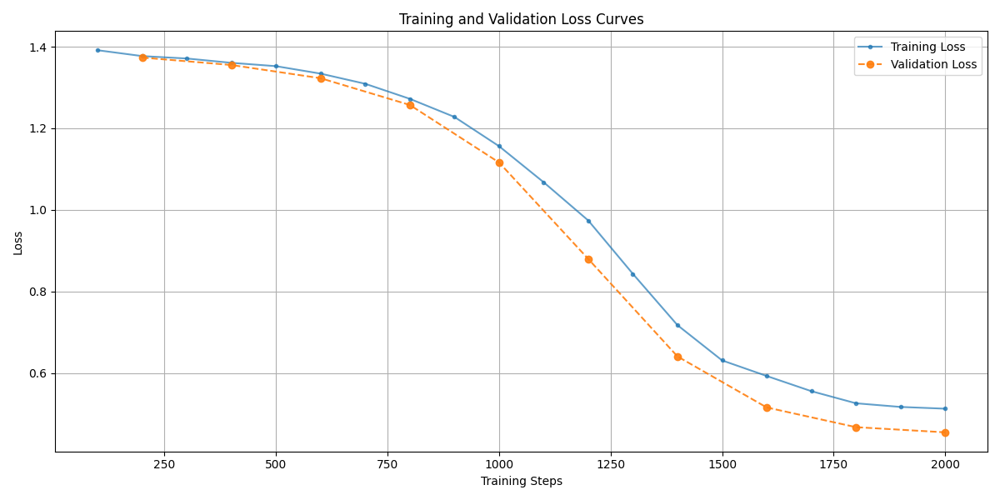

# AG‑News Classification with LoRA‑fine‑tuned RoBERTa


## 📖 Introduction

This project demonstrates how to fine‑tune [**RoBERTa‑base**](https://arxiv.org/abs/1907.11692) for news‑topic classification on the AG News dataset **using Low‑Rank Adaptation (LoRA)**—all inside a single, self‑contained **Jupyter notebook (**``**)**.  LoRA inserts small rank‑decomposition matrices into the attention projections, letting us adapt a large pre‑trained model with a **fraction of the parameters** and GPU memory normally required.

## 🎯 Purpose of the Notebook

- Provide a **reproducible walkthrough** of LoRA for sequence classification using Transformers & PEFT.
- Log metrics, checkpoints, and the final merged model in one place.
- Empirically show why **rank 4 / alpha 4** strikes the best accuracy–efficiency balance on a single‑GPU workstation.

## 🏗️ Experimental Setup

| Component      | Value                                       |
| -------------- | ------------------------------------------- |
| Base model     | `roberta-base`                              |
| Dataset        | AG News                                     |
| Adapter method | LoRA                                        |
| **Rank **``    | **4**                                       |
| **Alpha**      | **4**                                       |
| Dropout        | 0.2                                         |
| Optimizer      | **AdamW**                                   |
| Learning rate  | 1 × 10⁻⁵                                    |
| Batch size     | 16 (train) / 64 (eval)                      |
| Steps          | 2 000                                       |
| Hardware       | NVIDIA **RTX 4090** (24 GB VRAM)            |

### Why **r = 4, α = 4**?

Lower ranks (e.g. 2) under‑fit, while higher ranks (≥ 8) yield only marginal accuracy gains at the cost of more parameters and longer runtime. Rank 4 provides the **best validation accuracy (\~ 89 %)** with an adapter of \~0.8 M parameters—just 0.4 % of full RoBERTa‑base.

## 📉 Loss Curves
                                                                                                                                                                                               


The plot above tracks training and validation loss over 2 000 steps.  Validation loss consistently stays below training loss, signalling healthy generalisation and the regularising effect of LoRA.

## 🚀 Getting Started

> **Prerequisite:** A CUDA‑capable GPU (≈8 GB VRAM minimum; 24 GB for full batch sizes).  CPU execution works but will be slow.

```bash
# 1. Clone the repo and enter it
git clone https://github.com/SaniyaGapchup/DL_Proj2_LORA_Finetuning.git
cd roberta‑agnews‑lora

# 2. Create an environment
conda create -n lora_roberta python=3.10
conda activate lora_roberta
pip install torch transformers peft datasets evaluate matplotlib scikit-learn pandas numpy jupyter

# 3. Launch Jupyter
jupyter lab  # or jupyter notebook
# Open DL_P2.ipynb and run the cells top‑to‑bottom
```

The notebook will:

1. Download AG News and RoBERTa‑base.
2. Configure LoRA (r = 4, α = 4).
3. Train for 2 000 steps with AdamW.
4. Plot the loss curves and evaluate accuracy.
5. Save the adapter, merged model, and a CSV of predictions (if unlabelled data is provided).

## 📂 Repository Contents

```
├── DL_P2.ipynb              # main notebook (run this!)
├── loss_curves.png          # training/validation loss plot
├── roberta_agnews_finetuned/   # LoRA checkpoints & merged model
│   ├── adapter_model.bin
│   └── ...
└── README.md
```

## 📝 Results

The notebook continues to keep **validation** and **test** data strictly separate:

* **Validation set** – 1 280 examples *held‑out* from the original training split (stratified via `train_test_split`).  Used only for early stopping and hyper‑parameter selection.
* **Test set** – **all 7 600 rows** of the official AG News test split.  Never seen during training or validation.

| Split | Size | Accuracy |
|-------|------|----------|
| Validation | 1 280 | **≈ 89 %** |
| Test | 7 600 | **≈ 88 %** |

Evaluating on the full test corpus confirms the model generalises well; scores fall in the 88-89 % band depending on random seed.

## ✨ Acknowledgements

- **Hugging Face** community for datasets and tooling.
- **LoRA** (Hu *et al.*, 2021) for parameter‑efficient fine‑tuning.

## 📜 License

Released under the MIT License. See `LICENSE` for details.

